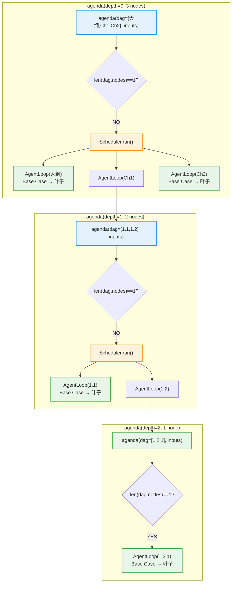
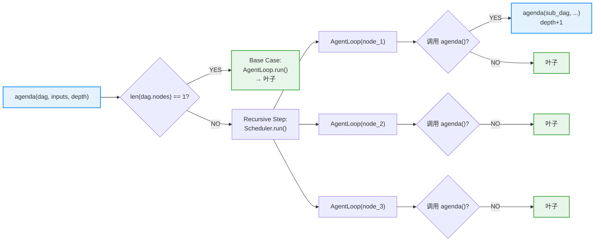
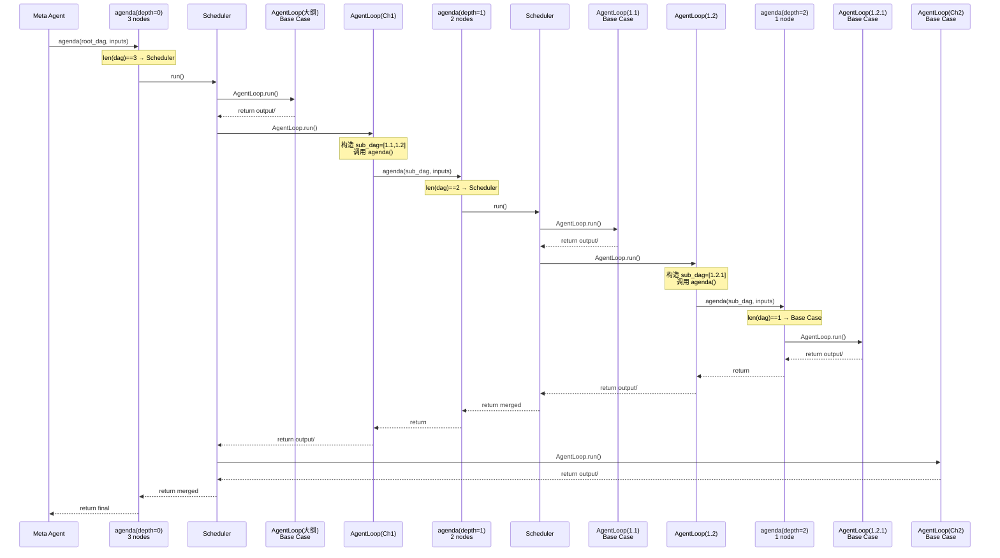
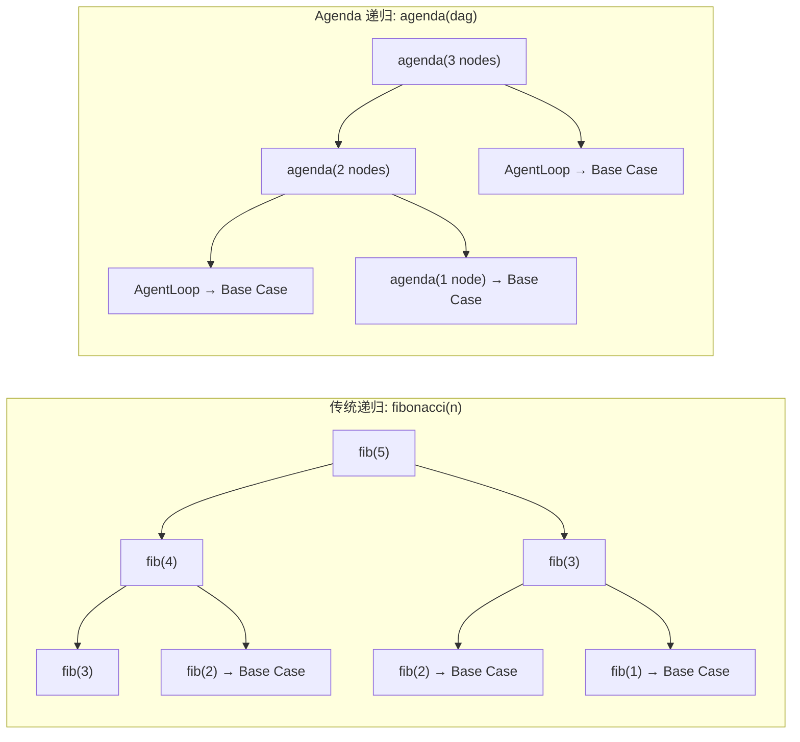
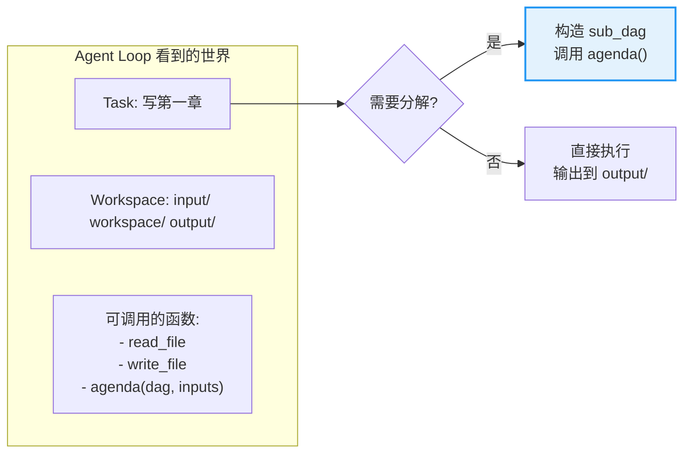

# Agenda 递归设计 — Mermaid 可视化

## 1. 递归调用树（每个节点 = agenda 调用）

**图例：**
- 🔵 蓝框 = `agenda()` 调用
- 🟠 橙框 = `Scheduler.run()`（仅在 nodes > 1 时出现）
- 🟢 绿框 = `AgentLoop.run()` Base Case（叶子节点）

**关键：** 每个 agenda 节点内部先判断 `len(dag.nodes)==1`。如果是 → 直接 AgentLoop（叶子）。如果不是 → 启动 Scheduler，Scheduler 启动多个 AgentLoop，某些 AgentLoop 可能继续调用 agenda()。

---

## 2. 单个 agenda 调用的内部结构

---

## 3. Sequence Diagram（完整调用链）

---

## 4. 传统递归 vs Agenda 递归（同构性）

**同构性：** 两者都是树形递归。传统递归由函数参数驱动（n-1, n-2），Agenda 递归由 Agent 构造的 DAG 驱动。

---

## 5. Agent Loop 视角（位置透明性）

**Agent Loop 不知道：** 自己是 depth=0 还是 depth=5，外面还有没有更大的 DAG，调用 `agenda()` 会触发什么。它只看到一个 task、一个 workspace、一组可调用的函数（含 `agenda()`）。
